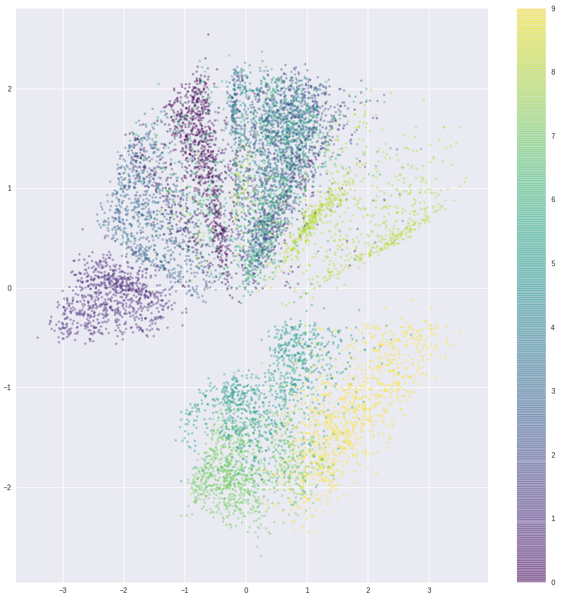
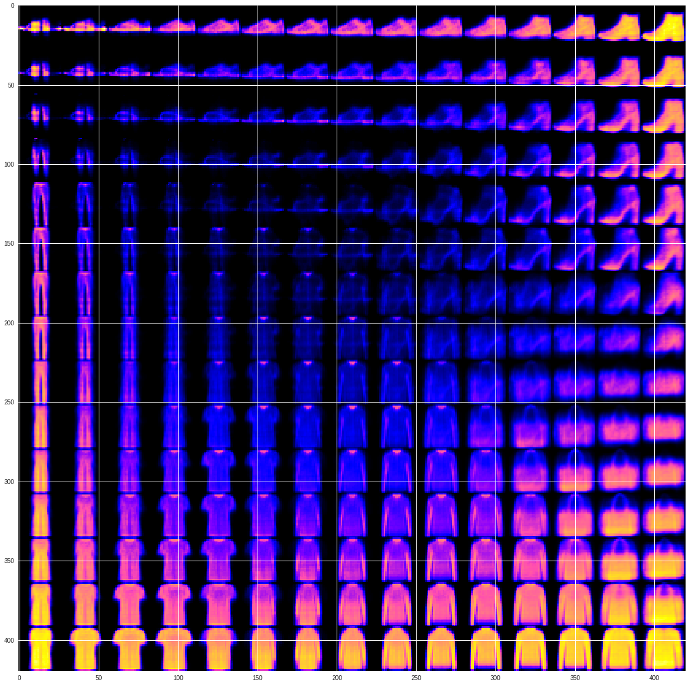

# Variational Autoencoders in Keras

Implementing a [Variational Autoencoder (VAE)](https://www.jeremyjordan.me/variational-autoencoders/) in Keras to generate the Fashion-MNIST dataset.

## Clustering of images in latent space

## Visualizing sample images

